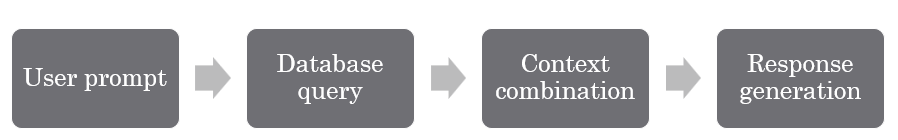

# RAG chatbot on internet toxicity
A class project on building a RAG chatbot with a curated database about internet toxicity

[Try this chatbot on Streamlit!](https://ragchatbotoninternettoxicity-pfrydggywcarcdjkbfql8d.streamlit.app/)

## Project Description and domain overview
This project aims to develop a Retrieve-Generate chatbot (Retrieval-Augmented Generation) that addresses the issue of internet toxicity. Utilizing a carefully curated database on the topic, the chatbot provides insights into the causes and effects of toxicity online, alongside strategies for mitigating harm when encountering toxic content. 

Internet toxicity has been an ever-growing problem that looms the internet thanks to the rise of global political polarization and echo-chambers on social media. To combat this rising risk, the chatbot is trained to answer factual questions, analyze text for toxicity, and suggest resources for users seeking to mitigate harm from encountering online toxicity.

## Architecture

1. **User prompt**: User types in an input for the chatbot.
2. **Database query**: From the pre-generated dataset with carefully-curated contents, relevant documents are fetched based on user input.
3. **Context combination**: Prompt context is generated by combining retrieved data from the dataset and the user input, ensuring its information being relevant and consistent.
4. **Response generation**: The large language model kicks in to generate response based on the processed context. Response is presented to the user along with fetched data.

## Document Collection Summary
The dataset consists of expert commentary, user interviews, analysis papers, social media regulation rules, and established NLP toxicity analysis datasets. This diverse selection make sure the bot can to handle a variety of related questions.

- **Expert Commentary & Analysis Papers**: Provide in-depth definitions, data analysis, and insights into causes and status-quo of toxicity.
- **User Interviews**: Offer real-world perspectives and suggestions on the effects of toxicity and how to combat it.
- **Regulation Rules**: Introduce regulatory information for understanding how these relevant social media platforms manage rampant toxic content.
- **NLP Training Datasets**: Train the model to accurately identify and evaluate the toxicity in user-submitted text.

## Agent Configuration Details
- **Role**: Focus on both accuracy and user-friendliness - "Expert **and public lecture host**, **can explain concept in simpler terms if necessary**"
- **Task**: Make sure the responses are consistent - by "prioritizing database sources" in the Task description, and setting a low temperature and low frequency_penalty.
